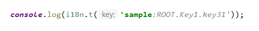
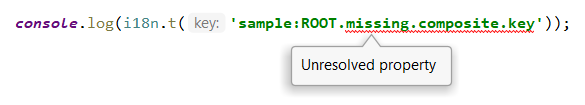
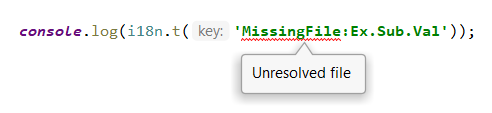
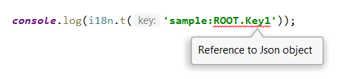
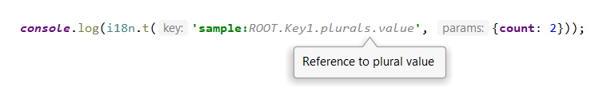
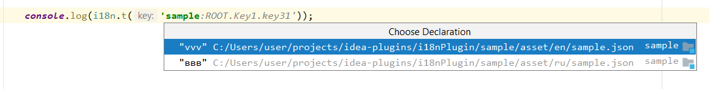
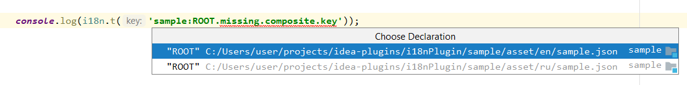

# i18nPlugin

Intellij idea i18next support plugin

## Features
 ### Annotations

-   Annotates correct i18n keys:

    

-   Unresolved properties:

    

-   As well as unresolved files:

    

-   References to Json object:

    

-   References to plural values:

    

 ### Navigation

-   I18nPlugin provides navigation from key to its declaration in Json resource    

    

-   and to partially resolved keys:

    
    
 ### Hints
 
-   In the case of a single translation matching to given key the translation displayed as a hint (Ctrl + hover):
 
    
    
 ### Configuration options 
 
 ##### File -> Tools -> I18n plugin configuration 
 
 -  Default namespace
 
    Configure default namespace translation file. 
    Multiple default namespaces separated by comma, semicolon or whitespace:
    
        first;second third,fourth
        
    will resolve translations in files first.json, second.json, third.json, fourth.json
     
